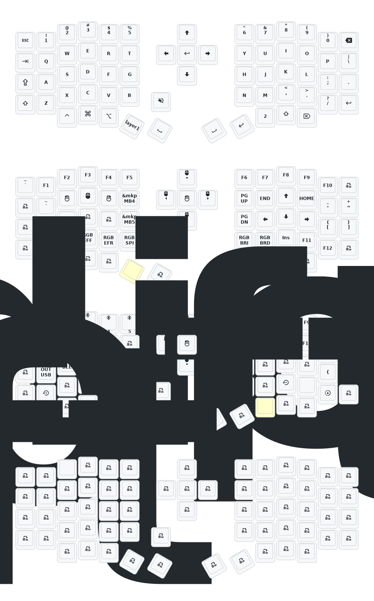

# Eyelash Sofle Dongle

ZMK 기반 `Sofle` 분할 키보드용 동글 펌웨어 설정 저장소입니다.  
이 저장소는 **동글 1개 + 좌/우 하프 2개** 조합을 기준으로 합니다.

> 처음 사용할 때는 `settings_reset` 후 `central_dongle`, `left`, `right` 펌웨어를 다시 올리는 쪽이 가장 안전합니다.

## 핵심 구조

- 동글: 호스트(맥/PC/태블릿)와 연결되는 중앙 유닛
- 왼쪽/오른쪽 하프: 동글에 붙는 peripheral
- 키맵/설정: `config/`
- 실드 정의: `boards/shields/eyelash_sofle/`
- 빌드 매트릭스: `build.yaml`

## 펌웨어 파일

GitHub Actions 빌드 결과물에서 보통 아래 4개를 사용합니다.

- `eyelash_sofle_central_dongle_oled.uf2`
- `eyelash_sofle_peripheral_left.uf2`
- `eyelash_sofle_peripheral_right.uf2`
- `settings_reset.uf2`

> `uf2` 파일 복사 직후 USB 드라이브가 사라지는 것은 보통 정상입니다. 보드가 재부팅되며 부트로더 모드에서 빠져나오기 때문입니다.

## 권장 플래시 순서

1. 동글, 왼쪽, 오른쪽 각각에 `settings_reset.uf2` 업로드
2. 전원 재시작
3. 같은 빌드 세트의 최신 `uf2`를 각 유닛에 업로드
4. 동글과 좌/우 하프가 먼저 서로 연결되는지 확인
5. 그 다음 맥/PC와 동글을 페어링

부트로더 진입이 안 될 때

- `nice!nano` 계열은 보통 리셋 버튼을 빠르게 2번 눌러 부트로더에 진입합니다.
- USB 케이블은 반드시 데이터 전송이 되는 케이블이어야 합니다.
- 복사 도중 연결이 끊기는 것처럼 보여도, 실제로는 플래시 후 자동 재부팅일 수 있습니다.

## 블루투스 연결

이 키맵은 **동글 버튼이 아니라 키보드 키**로 블루투스 프로필을 조작합니다.

- `layer 2`에 `BT_SEL 0~4`
- `BT_CLR`, `BT_CLR_ALL`
- `OUT_USB`, `OUT_BLE`

기본 레이어에서 오른손 엄지 쪽 `mo 2`를 누르고 있으면 `layer 2`가 열립니다.

> 동글이 맥에 "연결됨"으로 뜨더라도 입력이 USB로만 들어간다면, 현재 출력이 `OUT_USB`일 가능성이 큽니다.

연결이 꼬였을 때 확인할 것

- 맥/PC에 등록된 기존 Bluetooth 기기 삭제
- 각 유닛에 `settings_reset.uf2` 적용
- 같은 GitHub Actions 실행에서 나온 펌웨어 3개를 함께 사용
- 왼쪽/오른쪽 파일을 뒤바꾸지 않았는지 확인

## ZMK Studio

이 저장소는 `ZMK Studio` 지원 빌드가 켜져 있습니다.  
레이어와 키 재배치는 Studio로 수정하는 것이 가장 편합니다.

- Studio: `https://zmk.studio/`
- USB 연결 상태에서 사용하는 것을 권장
- 키맵 변경은 기기 내부 설정으로 저장됨

> Studio에서 키맵을 수정한 뒤에는 이 저장소의 `.keymap` 파일이 자동으로 갱신되지 않습니다.

Studio 사용 범위

- 가능한 것: 레이어 변경, 키 재배치, 투명 키 설정
- 저장소에서 직접 해야 하는 것: 실드, 오버레이, 보드 설정, 빌드 설정
- 파일 기반 키맵으로 완전히 되돌리려면 Studio의 `Restore Stock Settings`가 필요할 수 있습니다.

## 현재 키맵 메모

- `layer 1`: 일반 키 기반 마우스 동작 제거
- `layer 1`: underglow 관련 키 제거
- `layer 2`: Bluetooth / 출력 관련 키 유지

## 키맵 미리보기

